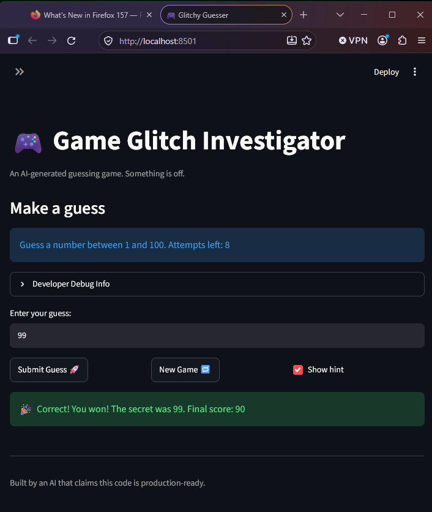

# 🎮 Game Glitch Investigator: The Impossible Guesser

An AI-generated guessing game that needed debugging. This project diagnoses and fixes bugs in the original `app.py`, refactors game logic into `logic_utils.py`, and adds automated tests with pytest.

---

## 📌 The Situation

You asked an AI to build a simple "Number Guessing Game" using Streamlit. It wrote the code, ran away, and now the game is unplayable.

**Symptoms in the starter code:**
- You can't win.
- The hints lie to you.
- The secret number seems to have commitment issues.

---

## 🛠️ Setup

1. **Clone this repo:**
   ```
   git clone https://github.com/codewarrior777/ai110-module1show-gameglitchinvestigator-starter.git
   cd ai110-module1show-gameglitchinvestigator-starter
   ```

2. **Create and activate a virtual environment:**

   Windows PowerShell:
   ```
   python -m venv .venv
   .\.venv\Scripts\Activate.ps1
   ```

   macOS / Linux:
   ```
   python3 -m venv .venv
   source .venv/bin/activate
   ```

3. **Install dependencies:**
   ```
   pip install -r requirements.txt
   ```

4. **Run the game:**
   ```
   python -m streamlit run app.py
   ```

5. **Run the tests:**
   ```
   python -m pytest tests/ -v
   ```

---

## 🎯 Your Mission (what was fixed)

1. **Fix the hints** — the "Higher/Lower" feedback was inverted.
2. **Fix the secret state bug** — the secret was converted to a string on even attempts, silently breaking comparisons.
3. **Fix the score logic** — wrong guesses could award points, and the score could go negative.
4. **Refactor & Test** — game logic moved from `app.py` into `logic_utils.py` and covered by pytest.

---

## 🖼️ Demo Walkthrough

A textual walkthrough of one full session with the fixed game:

1. User opens the app. A random secret number is generated within the difficulty's range (1–100 on Normal).
2. User enters a guess of 80. The game shows "📉 Go LOWER!" because 80 is higher than the secret.
3. User enters a guess of 20. The game shows "📈 Go HIGHER!" because 20 is lower than the secret.
4. Score decreases by 5 after each wrong guess.
5. User enters the correct secret. The game shows "🎉 Correct!", awards the win bonus, and ends the round.
6. User clicks "New Game" to reset the score and pick a fresh secret.

**Screenshot:**



**Demo video**: [Watch the winning moment 🎉](video_winning_game_AI_2026.mp4)

---

## 🧪 Test Results

The test suite covers both core behavior and edge cases (Challenge 1).

```
$ python -m pytest tests/ -v
============================= test session starts =============================
platform win32 -- Python 3.14.0, pytest-9.1.1, pluggy-1.6.0
rootdir: C:\Users\gusra\OneDrive\ai110-module1show-game
plugins: anyio-4.15.1
collected 6 items

tests/test_game_logic.py::test_winning_guess PASSED                       [ 16%]
tests/test_game_logic.py::test_guess_too_high PASSED                      [ 33%]
tests/test_game_logic.py::test_guess_too_low PASSED                       [ 50%]
tests/test_game_logic.py::test_parse_guess_rejects_non_numeric_input PASSED  [ 66%]
tests/test_game_logic.py::test_parse_guess_rejects_empty_input PASSED     [ 83%]
tests/test_game_logic.py::test_parse_guess_converts_float_string_to_int PASSED [100%]

============================== 6 passed in 0.41s ==============================
```

### What each test verifies

| Test | Behavior protected |
|---|---|
| `test_winning_guess` | Correct guess returns "Win" |
| `test_guess_too_high` | Guess above secret returns "Too High" |
| `test_guess_too_low` | Guess below secret returns "Too Low" |
| `test_parse_guess_rejects_non_numeric_input` | Non-numeric strings like `"abc"` are rejected |
| `test_parse_guess_rejects_empty_input` | Empty string `""` is rejected cleanly |
| `test_parse_guess_converts_float_string_to_int` | `"3.7"` truncates to `3` without crashing |

---

## 📁 Project Structure

```
ai110-module1show-gameglitchinvestigator-starter/
├── app.py                               # Streamlit UI only
├── logic_utils.py                       # Pure game logic (testable)
├── tests/
│   └── test_game_logic.py               # pytest suite (6 tests)
├── reflection.md                        # Bug log, AI collaboration, debugging notes
├── ai_interactions.md                   # AI prompts and rationales per challenge
├── screenshot_winning_game_AI_2026.png  # Win-state screenshot
├── video_winning_game_AI_2026.mp4       # Win-state screen recording
├── requirements.txt
└── README.md
```

---

## 🚀 Stretch Features

- [x] **Challenge 1 — Advanced Edge-Case Testing**: 3+ pytest cases targeting complex edge cases (non-numeric strings, empty inputs, float-as-string inputs). See `tests/test_game_logic.py` and `ai_interactions.md`.
- [ ] Challenge 2 — Feature Expansion via Agent Mode
- [ ] Challenge 3 — Professional Documentation
- [ ] Challenge 4 — Enhanced Game UI
- [ ] Challenge 5 — AI Model Comparison

---

## 🙏 Credits

Built by an AI that claimed this code was production-ready. Debugged and refactored by a human who disagreed.